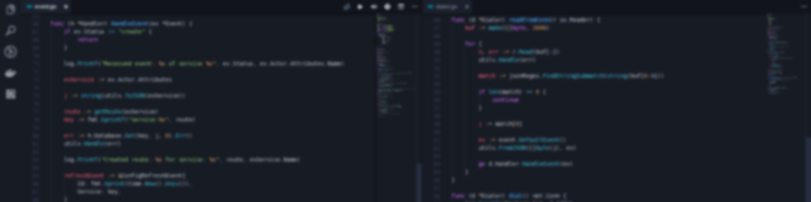

<h1 align="center">👋 Hi, I'm Patricio</h1>

  
  
  
  

  <a href="https://notquine.dev">📖 Blog</a> - <a href="mailto:hi@patricionapoli.dev">📧 Contact</a> - 
   <a href="https://linkedin.com/in/patricionapoli"> LinkedIn</a>

<h3> 🧔🏻‍♂️ About </h3>

- Bachelor's Degree in Information Technology. Thesis on crypto value prediction with Deep Learning
- I'm in a constant quest for challenges and never afraid of learning new technologies.
- Mainly interested on distributed systems, blockchain, machine learning, and opengl 
- I enjoy taking on complex problems and offering innovative solutions, be it code or architecture
- I'm a team player, fast-learner and versatile programmer

<h3> 🚀 Projects </h3>

- [Moonsyrup Protocol](https://moonsyrup.com) (Substrate-based Protocol)
- [Clan Platform](https://www.clanacademy.com/) (Rust Microservices, ChatGPT3.5, SurrealDB, Svelte App)
- [Nebula](https://github.com/PatricioNapoli/nebula) (C++ - OpenGL & Vulkan modern game engine with ECS)

